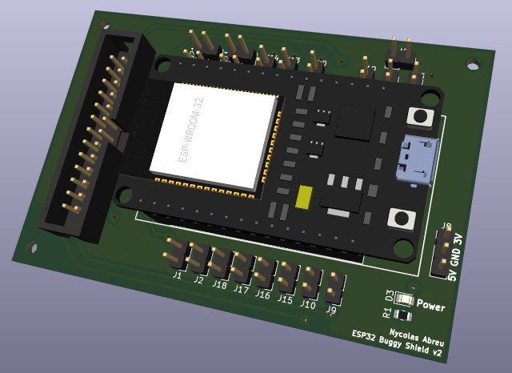

# Buggy_TCC

O projeto segue as informações disponíveis em https://github.com/xtarke/automated_buggy

## ESP32 Pinout

### Pinos analógicos

| ESP32 pin | Analog input | Signal |
| --------- | ------------ | ------ |
| D32       | ADC0         | Bat0   |
| D33       | ADC1         | Bat1   |
| X         | ADC2         | Ampop1 |
| X         | ADC3         | Ampop2 |

### Sensor ultrassônico

| ESP32 Pin | Signal |
| --------- | ------ |
| D13       | Echo0  |
| D12       | Trig0  |
| D14       | Echo1  |
| D27       | Trig1  |

### Motores

| ESP32 Pin | Signal |
| --------- | ------ |
| D21       | PWM1   |
| D22       | PWM1N  |
| D18       | PWM2   |
| D19       | PWM2N  |

### Encoder de velocidade

| ESP32 Pin | Signal |
| --------- | ------ |
| D2        | D0     |
| D4        | D1     |

### Sensor ótico

| ESP32 Pin | Signal |
| --------- | ------ |
| D26       | R_TCRT |
| D25       | L_TCRT |

### UART

| ESP32 Pin | Signal |
| --------- | ------ |
| TX        | TX     |
| RX        | RX     |

## Shield projeto

## Block IDEs

- https://microblocks.fun/
- http://bipes.net.br/ide/
- https://app.edublocks.org/
- http://easycoding.tn/esp32/demos/code/
- https://ide.codeskool.cc/

## Temporário

- https://randomnerdtutorials.com/esp32-pinout-reference-gpios/

- https://www.electronicshub.org/esp32-pinout/
